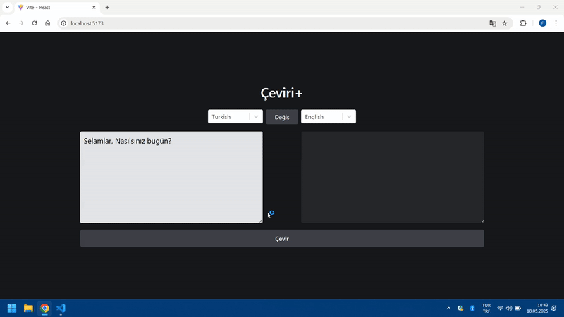

# 🌐 Translate App

React ile geliştirilmiş modern ve kullanıcı dostu bir çeviri uygulaması. Kullanıcılar seçilen diller arasında metin çevirisi yapabilir. Uygulama, bir çeviri API’si kullanarak gerçek zamanlı veri sağlar.

# 🚀 Özellikler

🌍 Gerçek zamanlı metin çevirisi

🔄 Kaynak ve hedef dili seçme

💡 Temiz ve sade kullanıcı arayüzü

📱 Mobil uyumlu tasarım

# 📸 Ekran Görüntüsü

